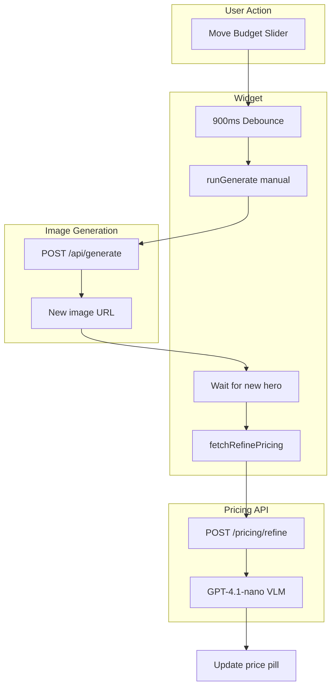

# Budget Slider → Regenerate → Re-Price Flow

## Overview

When the user moves the budget slider, we need to:
1. Regenerate the image with the new budget (already happens)
2. **After** the new image is ready, send it to the pricing API with refinement context
3. Update the displayed price with the new estimate

The pricing API needs extra context: "We had a preview with price range $X–$Y. The user adjusted their budget to $Z and requested a design at that level. This image reflects that. Estimate the price range for this refined design."

---

## Architecture



---

## Implementation Plan

### 1. New pricing refine endpoint (ai-form-service)

**Option A: New route** (recommended for clarity)
- `POST /ai-form/{instanceId}/pricing/refine` 
- Same schema as pricing, plus required `refinementContext`:
  ```json
  {
    "previewImageUrl": "https://...",
    "refinementContext": {
      "previousImagePriceRange": { "low": 35000, "high": 50000 },
      "userBudget": 42000,
      "intent": "refine_after_budget_adjustment"
    },
    "sessionId": "...",
    "stepDataSoFar": {...},
    ...
  }
  ```

**Option B: Extend existing route**
- Add optional `refinementContext` to the existing pricing request
- When present, use refinement prompt path

**Files:**
- [apps/ai-form-service/api/routers/pricing.py](apps/ai-form-service/api/routers/pricing.py) — add refine route or extend handler
- [apps/ai-form-service/src/programs/pricing/orchestrator.py](apps/ai-form-service/src/programs/pricing/orchestrator.py) — accept refinementContext, pass to VLM
- [apps/ai-form-service/src/programs/pricing/replicate_vlm.py](apps/ai-form-service/src/programs/pricing/replicate_vlm.py) — add refinement prompt variant

### 2. VLM prompt for refinement

When `refinementContext` is present, augment the system prompt:

```
The user previously saw a design with an estimated price range of $X–$Y. 
They adjusted their budget slider to $Z and requested a new design that reflects 
a more/less expensive tier. This image was generated with that budget in mind. 
Estimate the price range for this refined design. Use the service_summary for 
the typical service range. Output JSON with image_price_range and service_price_range.
```

### 3. Widget API route

**File:** [apps/widget/app/api/ai-form/[instanceId]/pricing/route.ts](apps/widget/app/api/ai-form/[instanceId]/pricing/route.ts)

- Add `POST /api/ai-form/[instanceId]/pricing/refine` that forwards to the new backend route
- Or: forward `refinementContext` when present to the existing pricing upstream

### 4. Widget: call refine pricing after regeneration

**File:** [apps/widget/components/form/steps/image-preview-experience/gallery/ImagePreviewExperience.tsx](apps/widget/components/form/steps/image-preview-experience/gallery/ImagePreviewExperience.tsx)

**Current flow (bug):**
- Slider change → debounce → `runGenerate("manual")` + `fetchAccuratePricing()` in same tick
- `fetchAccuratePricing` uses the **old** hero (regeneration hasn't completed yet)

**New flow:**
1. Slider change → debounce → `runGenerate("manual")` only (no immediate fetch)
2. When `runGenerate` was triggered by budget slider, set `pendingBudgetRefineRef = { previousImagePriceRange, userBudget }`
3. Add `useEffect` that watches `hero` and `cache?.status`: when we transition from `running` → `complete` and `pendingBudgetRefineRef` is set, call `fetchRefinePricing(hero, pendingBudgetRefineRef)` then clear the ref
4. `fetchRefinePricing` calls the refine endpoint with `previewImageUrl: hero` and `refinementContext`

**Implementation details:**
- `runGenerate` is async; the hero updates when cache gets a new run
- Use `runs.length` increase + `pendingBudgetRefineRef` to detect "regeneration just completed from budget slider"
- Avoid refining when hero changes for other reasons (e.g. user navigates to previous run)

### 5. Simplified widget flow

1. **Budget slider effect:** On debounce, set `pendingBudgetRefineRef.current = { previousImagePriceRange, userBudget }`, call `runGenerate("manual")`. Do NOT call fetchAccuratePricing here.

2. **New useEffect:** `[runs.length, hero, pendingBudgetRefineRef]` — when `runs.length` increases (new run added) and `pendingBudgetRefineRef.current` is set and `hero` is a valid URL:
   - Call `fetchRefinePricing(hero, pendingBudgetRefineRef.current)`
   - Clear `pendingBudgetRefineRef.current`

3. **fetchRefinePricing:** Same as fetchAccuratePricing but POST to `/pricing/refine` with `refinementContext` in the body.

---

## Files to Create/Modify

| File | Action |
|------|--------|
| `apps/ai-form-service/api/routers/pricing.py` | Add `POST /ai-form/{instanceId}/pricing/refine` |
| `apps/ai-form-service/src/programs/pricing/orchestrator.py` | Add `estimate_pricing_refine` or branch on refinementContext |
| `apps/ai-form-service/src/programs/pricing/replicate_vlm.py` | Add refinement prompt variant |
| `apps/ai-form-service/src/schemas/api_models.py` | Add RefinementContext, RefinePricingRequest |
| `apps/widget/app/api/ai-form/[instanceId]/pricing/refine/route.ts` | Create — proxy to backend refine |
| `apps/widget/.../ImagePreviewExperience.tsx` | Budget effect + refine effect + fetchRefinePricing |

---

## Schema Additions

```python
# schemas/api_models.py
class RefinementContext(BaseModel):
    previous_image_price_range: dict  # {"low": int, "high": int}
    user_budget: int
    intent: str = "refine_after_budget_adjustment"
```

---

## Open Questions

1. **Same route vs new route:** New route keeps initial pricing clean; same route with optional refinementContext is simpler. Recommendation: new route `/pricing/refine` for clarity.
2. **Debounce:** Keep 900ms or adjust?
3. **Loading state:** Show "Updating price…" in the pill while refine is in flight?
